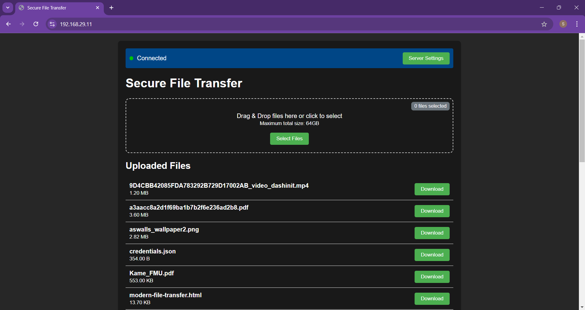
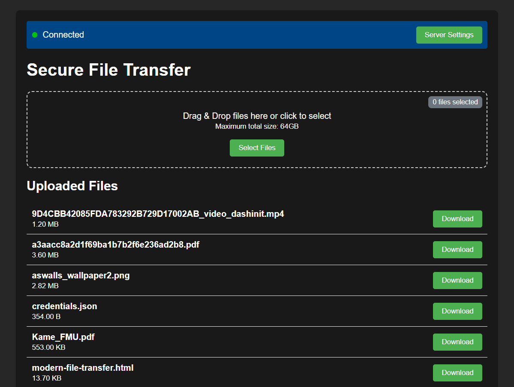
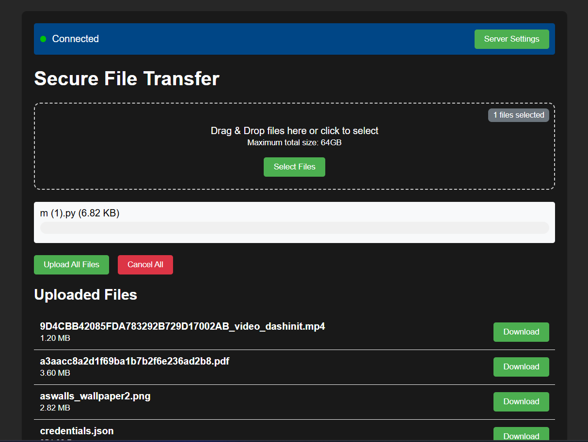
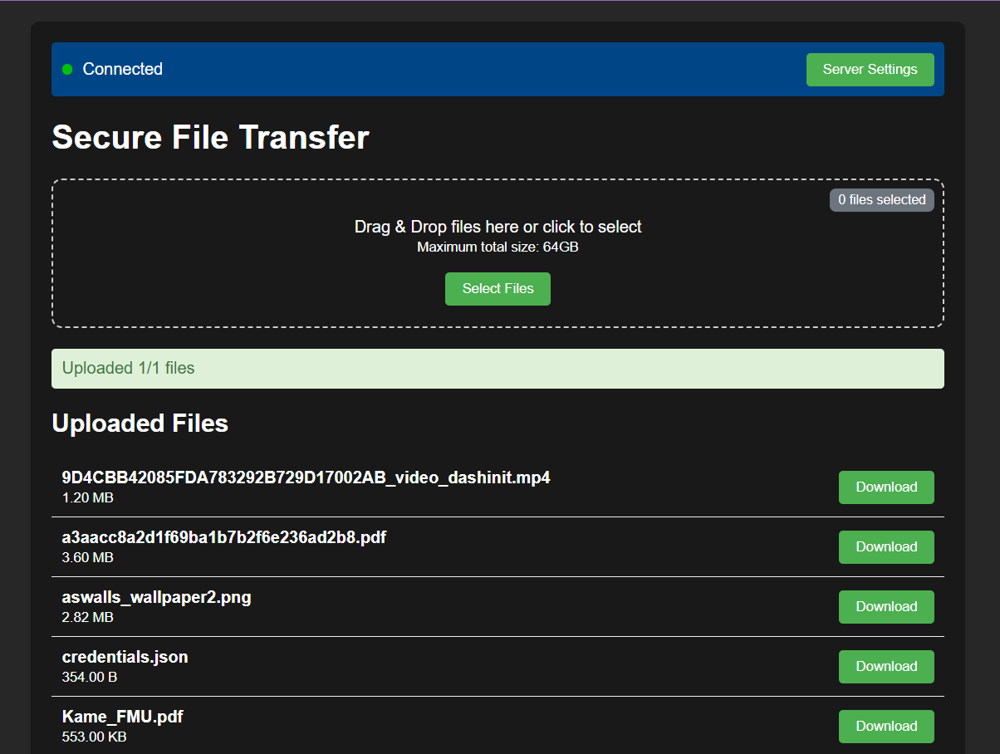
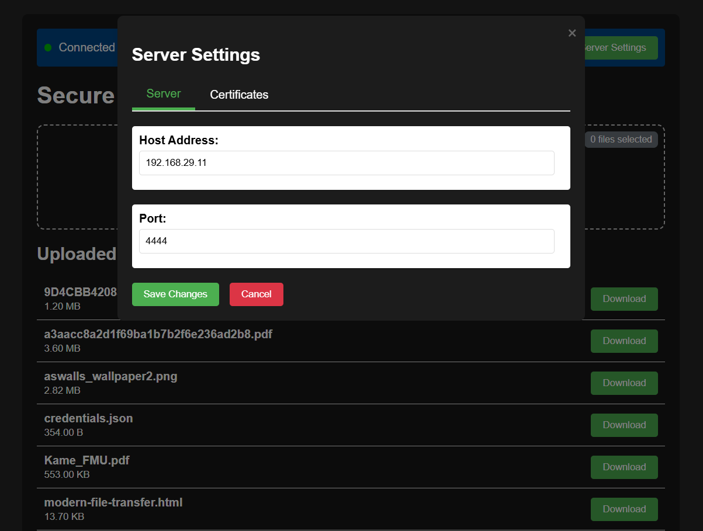
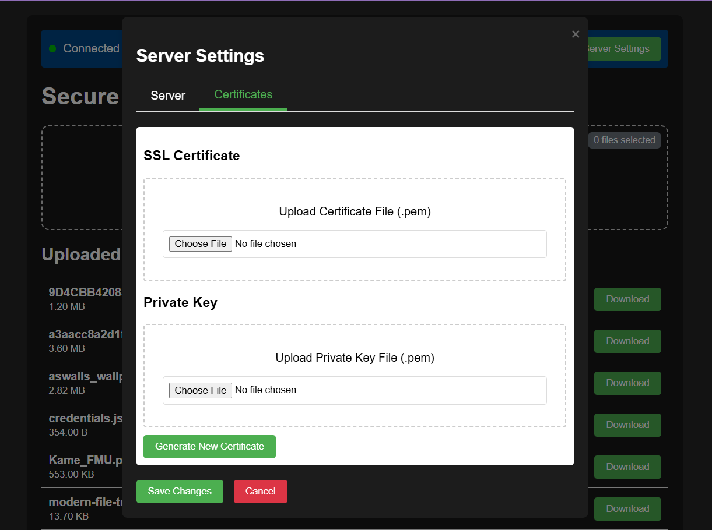

# local.HTTPS - 📡 A simple, local HTTPS web server
A simple, local HTTPS server in which we an seamlessly transfer any files in our LAN or local network using Wi-Fi (depends on its version) at its maximum speed.

Easily transfer files up to 64 GB (or more, based on configuration) over a secure, local HTTPS server using Python, Flask, Socket.io, JavaScript, HTML, and CSS. 📁🔒


## ⚙️ Features
 - Local HTTPS File Server – Transfers files over a secure, local Wi-Fi network.
 - Cross-Device Support – Send files from any device on the same Wi-Fi network.
 - File Size Limit Configurable – Default limit is 64 GB, but it can be increased as needed.
 - Real-Time File Transfer – Using Socket.io for seamless, real-time updates.


## 🚀 Setup
### 1. Clone the Repository

```bash
git clone https://github.com/alpha-void/local.HTTPS.git
cd https-file-transfer-server
```

### 2. Install Requirements
```bash
pip install -r requirements.txt
```

### 3. Install OpenSSL
#### Step 1: Download OpenSSL
Go to the https://slproweb.com/products/Win32OpenSSL.html download page.

Download the executable according to your PC requirements.

Note: Choose the “full” version instead of the "light" version to ensure all necessary libraries are included.

#### Step 2: Install OpenSSL 
Run the installer you downloaded (it may require admin permissions).

Copy OpenSSL DLLs to Windows System Directory: This is optional, but if you choose it, OpenSSL DLLs will be accessible system-wide. Otherwise, you’ll need to add OpenSSL to the PATH manually.

#### Step 3: Add OpenSSL to the System PATH (if necessary)
If you didn’t choose to copy DLLs to the system directory, follow these steps:

    1. Open Control Panel > System and Security > System.
    2. Click on Advanced system settings on the left side.
    3. Click the Environment Variables button.
    4. In the System variables section, find and select the Path variable, then click Edit.
    5. Click New and add the path to the OpenSSL bin folder. For example, if you installed OpenSSL in C:\Program Files\OpenSSL-Win64, add:
        C:\Program Files\OpenSSL-Win64\bin
    6. Click OK to save changes.

#### Step 4: Verify the Installation
Open Command Prompt or PowerShell.

Type openssl version and press Enter. You should see the version of OpenSSL installed, confirming the installation was successful.

### 4. Configure HTTPS
You’ll need SSL certificates to enable HTTPS. Place your certificate.pem and private_key.pem files in the project root. If you are not having any of these certificates it will be automatically created, when running the python file.

These files will be automatically after running the ```server.py```
```bash
├── certificate.pem
├── private_key.pem
├── server.py
├── server_config.ini
└── uploads/
```

### 5. Run the Server
```bash
python server.py
```
Server will be accessible at ```https://<your-local-ip>:5000```

## 📂 File Transfer Instructions
 - The main web server is the PC/Laptop/Server in which this python script is running.
 - Connect any other devices to the same Wi-Fi network as the server.
 - Visit the server URL in your browser to access the file upload/download interface.
 - Upload files (up to 64 GB) by selecting or dragging and dropping them into the provided area.
Tip: File size limit can be adjusted in the server configuration (server_config.ini file). 🌐

## 🔥 Demo Screenshots









Screenshot of the home page, where users can easily upload and download files.



An intuitive upload page with drag-and-drop support.



Download page with a list of available files and download progress.

## 📋 Technical Details
 - Python Flask: Acts as the backend server, managing HTTPS and file transfers.
 - Socket.io: Provides real-time updates for ongoing file transfers.
 - JavaScript: Enables dynamic file transfer interactions on the client side.
 - HTML & CSS: Clean and responsive design for a better user experience.

## 🔗 Dependencies
 - Flask for creating the web server.
 - flask-cors for handling Cross-Origin Resource Sharing (CORS) policies.
 - Flask-SocketIO for real-time communication using WebSockets.
 - eventlet to enable WebSocket compatibility with Flask-SocketIO.
 - Werkzeug for secure file handling and proxy management.
 - watchdog for monitoring file system events, allowing real-time file tracking.

Install all dependencies with:
```bash
pip install -r requirements.txt
```

## 🛠️ Configuration Options
You can modify the file size limit and port configuration in the ```server.py``` file to fit your needs.

| Parameter     | Description	           |Default Value            |
|---------------|--------------------------|-------------------------|
| MAX_FILE_SIZE	| Maximum file upload size | 64 * 1024 * 1024 * 1024 |
| PORT	Server  | port	                   | 5000                    |
| SSL_CERT_PATH	| Path to SSL certificate  | cert.pem                |
| SSL_KEY_PATH	| Path to SSL key	       | key.pem                 |


## License

[MIT](https://opensource.org/license/mit)


## Demo
Working of local.HTTPS

[Watch Demo Video](Screenshots/Videos/video.mp4)


## Authors

- [@alpha-void](https://www.github.com/alpha-void)
